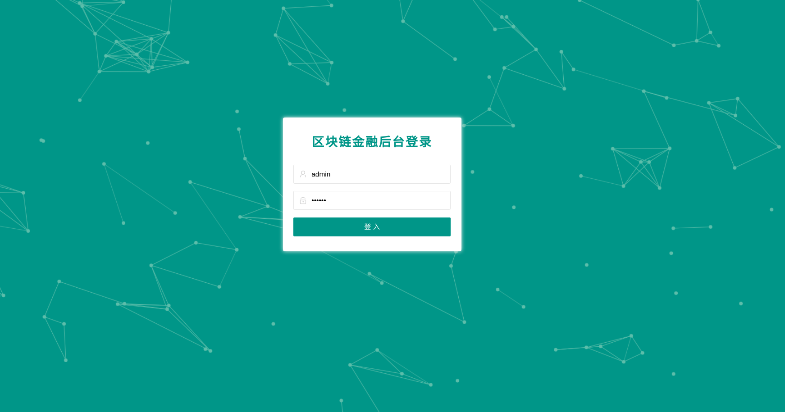
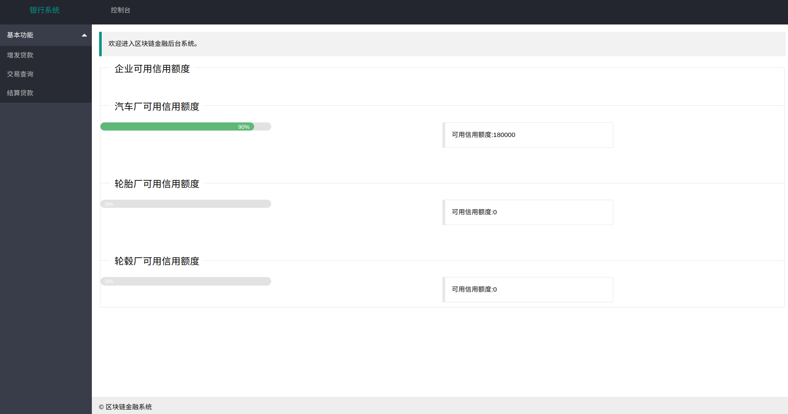

# 区块链金融系统
## 系统介绍
区块链金融系统运行于`fisco bcso`联盟连底层系统,并且使用了`github`的[样例项目链接](https://github.com/FISCO-BCOS/spring-boot-starter)完成了该系统的设计
- 系统主要由三个部分组成,前端显示页面,后端数据处理,链端数据保存
- 前端使用了[layui](https://github.com/sentsin/layui),是一个超轻量级的ui组件系统
- 后端使用了[Spring boot](https://spring.io/projects/spring-boot/)的模块化后端设计,极大地简化了普通web项目的构建过程,能够很好地上手并且完成项目设计
- 链端使用了[fisco bcso](https://github.com/FISCO-BCOS/FISCO-BCOS)联盟链的底层,主要是完成了数据的上链

## 系统运行
首先启动节点,命令是:
```
./nodes/0.0.0.0/start_all.sh
```
系统的所有配置已经完成,因此只需要输入如下命令:
```
git clone https://github.com/MIAFOREVER/BlockChain
cd BlockChain
./gradlew bootRun
```
浏览器输入127.0.0.1:8080/login,你就可以看到如下的登录界面

然后输入正确的密码就可以进入系统了

||bank|car|wheelhub|tyre|
|--|--|--|--|--|
|username|bank|car|wheelhub|tyre|
|password|123456|123456|123456|123456|

进入系统以后如图所示


